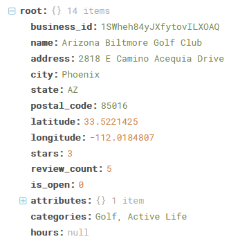
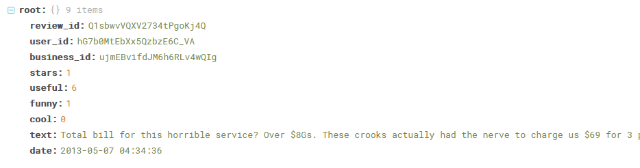

# Yelp Visualization Dashboard
Visualization of yelp dataset available on Kaggle. Requires active Google Maps API key

## Motivation 
According the Bureau of Labor Statistics, only 25% of business manage to stay open for more than 15 years. While there are some extraneous circumstances (i.e. a global pandemic) that could cause even successful businesses to fail, there is no doubt that opening a business provides its owners with inumerable challenges. With the advances of technology/analytics, the availability of tools to assist prospective business owners with the many different aspects of opening a business have greatly increased. Fore example, sites like Kickstarter and Gofundme help with gathering funds. Access to many software solutions that were once restricted to larger companies have now become more affordable for small business owners. However, one tool that has been missing is one that could help business owners with their market entrance strategy. 

While the hardest part of the small business creation process may in fact come before the market entrance itself, this part brings on many challenges of its own. Once an idea has translated from an idea to a physical space, the complexity of the problems that a business owner now faces increases exponentially. Questions can arise ranging from managing customers to managing the actual business space, assuming we are discussing a business with an actual location. The problems, if noy managed adequately, can lead a business to its demise. For this reason, a tool that would help prospective business owners anticipate potential issues in these domains can help them better prepare for them. 

This was my motivation behind creating this Yelp Data Visualization Dashboard. As part of my Collecting and Analyzing Big Data course at UCSD, I was tasked with the open ended assignment of finding any dataset and attempting to create and attempto to solve a hypothetical business question, in this case, "How can analytics be used to assist prospective business owners in planning for challenges to come with entering a new market". Specifically, I was hoping to use the abundant visualization tools associated with both geographic and text data to create a interactive platform for users to better understand possible locations/markets they hoped to enter. 

## The Data
The Yelp dataset is a publically available dataset on [Kaggle](https://www.kaggle.com/yelp-dataset/yelp-dataset). For this project, the specific datasets I was interested in were the business and business review datasets. The business dataset contained information about random business on Yelp in the form: 
 while the review dataset contained information that appeared like:

