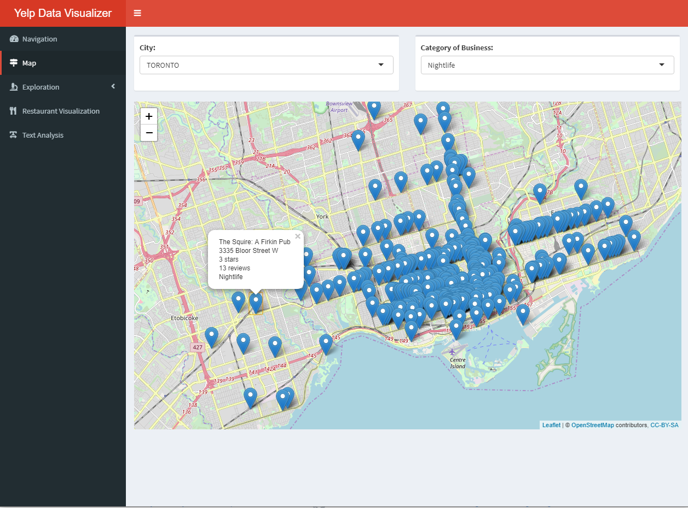
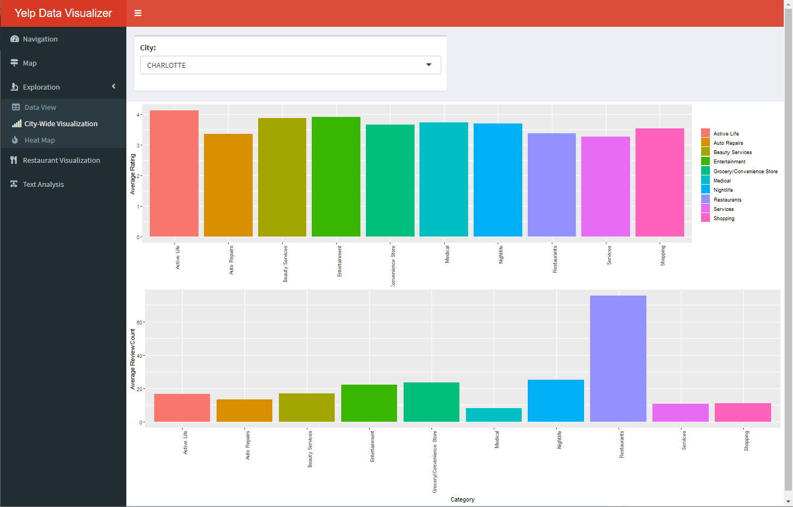
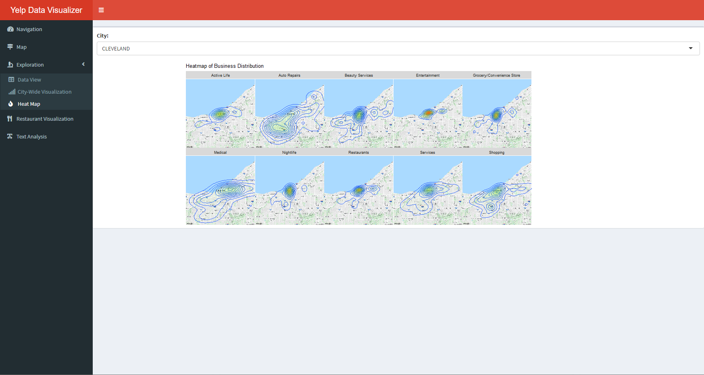
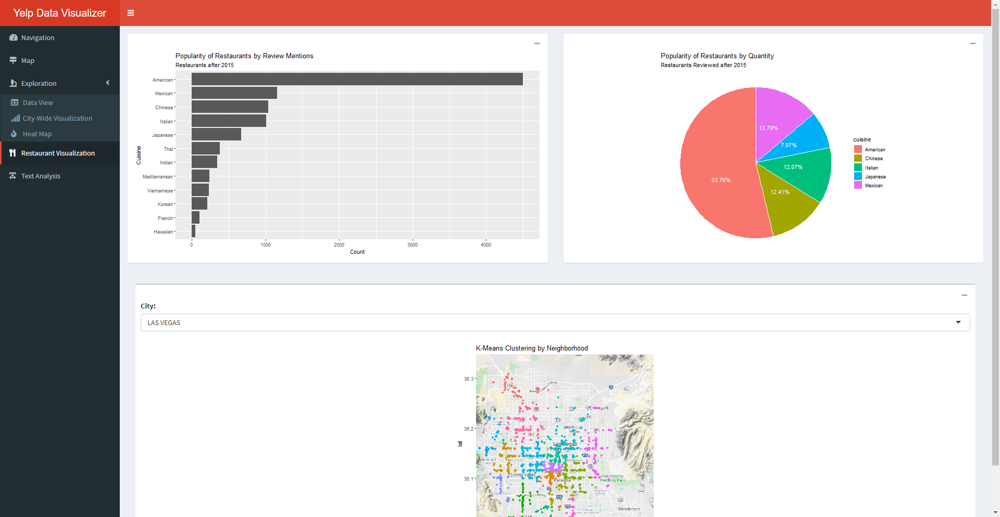
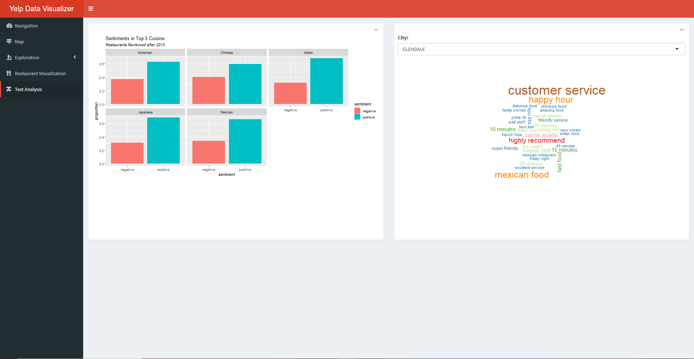

# Yelp Visualization Dashboard
Visualization of yelp dataset available on Kaggle. Requires active Google Maps API key

## Motivation 
According the Bureau of Labor Statistics, only 25% of business manage to stay open for more than 15 years. While there are some extraneous circumstances (i.e. a global pandemic) that could cause even successful businesses to fail, there is no doubt that opening a business provides its owners with inumerable challenges. With the advances of technology/analytics, the availability of tools to assist prospective business owners with the many different aspects of opening a business have greatly increased. Fore example, sites like Kickstarter and Gofundme help with gathering funds. Access to many software solutions that were once restricted to larger companies have now become more affordable for small business owners. However, one tool that has been missing is one that could help business owners with their market entrance strategy. 

While the hardest part of the small business creation process may in fact come before the market entrance itself, this part brings on many challenges of its own. Once an idea has translated from an idea to a physical space, the complexity of the problems that a business owner now faces increases exponentially. Questions can arise ranging from managing customers to managing the actual business space, assuming we are discussing a business with an actual location. The problems, if noy managed adequately, can lead a business to its demise. For this reason, a tool that would help prospective business owners anticipate potential issues in these domains can help them better prepare for them. 

This was my motivation behind creating this Yelp Data Visualization Dashboard. As part of my Collecting and Analyzing Big Data course at UCSD, I was tasked with the open ended assignment of finding any dataset and attempting to create and attempto to solve a hypothetical business question, in this case, "How can analytics be used to assist prospective business owners in planning for challenges to come with entering a new market". Specifically, I was hoping to use the abundant visualization tools associated with both geographic and text data to create a interactive platform for users to better understand possible locations/markets they hoped to enter. 

## The Data
The Yelp dataset is a publically available dataset on [Kaggle](https://www.kaggle.com/yelp-dataset/yelp-dataset). For this project, the specific datasets I was interested in were the business and business review datasets. The business dataset contained information about random business on Yelp in the form: 

 

while the review dataset contained information such as:

While this Kaggle dataset was a great resource, finding data on Kaggle was not my intended method of data collection. Since I chose R as my programming language of choice, I ran a Python script using BeautifulSoup/Selenium through R to collect data from Yelp. However, as Yelp prohibits scraping and the method was quite slow, I settled on the Kaggle data. 

## Building the dashboard
While my Big Data course had extensively covered ggplot and Tidyverse, Shiny was not. I decided to learn this tool as a way to apply what I had learned to a new R package. I had used some Shiny apps in the past, and this project would be a great way to investigate the usefulness of Shiny dashboards. After loading the data from Kaggle, the first steps were data "cleaning" (data comes relatively clean so hard to call it cleaning). My hope was to segment businesses by both category and location. Location would involve the use of Leaflet and a Google Maps API key to find the Lat/Lon coordinates of businesses from their address. Segmenting by category was hard to automate, and required the drafting of a list of the most popular business categories based on "domain knowledge". 

After creating categories for each business, it was time to decided on the different features:
 1. Visualization map

This visualization map allows for the simple visualization of businesses, either by city, category of business, or both. For example, here is a visualization of all nightlife businesses in Toronto:

As shown, clicking on a business will reveal its different attributes. Next was a general overview of the dataset, shown as a table:

Following the data view was a general visualization of business attributes within a city, specifically average rating and average review count. 

In this example, we can see these visualizations for the city of Charlotte, North Carolina. The next feature of the dashboard is a heatmap of business locations by category:

As the focus so far has been on geographic aspects of businesses, these visualizations are meant for the user to understand the location they are trying to enter (further extensions to be discussed later).

Next, the focus of the dashboard shifts to review text. For simplicity, the rest of the analysis concers restaurants in the dataset. The first set of visualizations concerns the popularity of restaurants by genre in both a bar in pie chart. Next is a visualizations of a K-Means clustering alogrithm used to show the distribution of restaurants among defined neighborhoods in each city. This is an overview of the review data, and appears as follows:

Finally, the app concludes with a overview of the sentiment in user reviews by category of the restaurant, as well as a worldcloud of most common words found in reviews, this time segmented by city:

